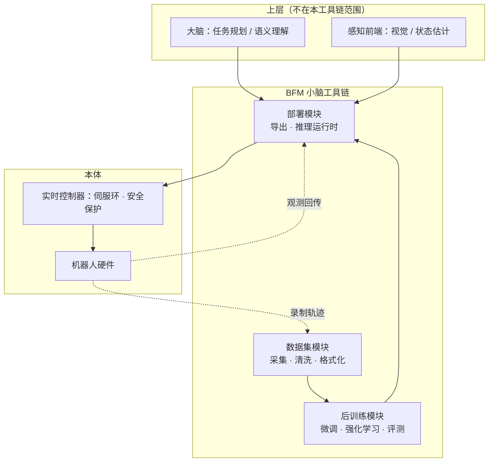
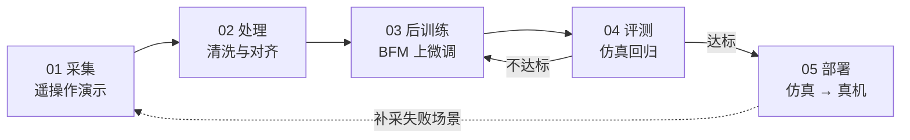

# 整体架构

工具链沿着一条主线组织：**数据进来，技能出去**。

<Stub>

- 下面的分层图是按通用形态画的，需要按实际代码结构校准模块名
- 补充各模块对应的仓库目录 / 包名
- 补充模块之间的接口约定（文件格式、通信协议）

</Stub>

## 分层结构

## 一条技能的生命周期

注意两条回边：评测不达标要回到训练，真机上暴露的失败场景要回到采集。**这两条回边才是实际工作中花时间最多的地方**，文档会在对应章节展开。

## 模块与文档对应

| 模块 | 职责 | 文档 |
| --- | --- | --- |
| 数据集 | 采集、清洗、格式化、版本管理 | [数据集](/docs/datasets/intro) |
| 后训练 | 微调、强化学习、评测、sim2real | [技能后训练](/docs/post-training/intro) |
| 部署 | 模型导出、推理运行时、真机上线 | [模型部署](/docs/deployment/intro) |
| BFM | 预训练权重与接口规范 | [BFM 模型](/docs/bfm/intro) |

## 目录结构

<Stub>

- 补充实际的仓库目录树与各目录用途

</Stub>

<!-- 待补充 -->
