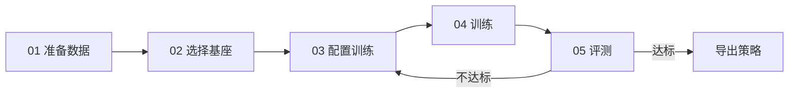

# 后训练流程

每个技能都走同一条路。流程固定下来，结果才可复现、可比较、可交接。

<Stub>

- 每一步补上实际命令与产物路径
- 补充各步骤的典型耗时与资源占用
- 明确产物的命名与归档规范

</Stub>

## 流程概览



## 01 准备数据

确认数据符合 [数据格式](/docs/datasets/format)，并跑一遍校验。

数据量的经验起点：<span className="badge-todo">待补充</span>

```bash
# TODO(待补充): 换成真实命令
```

## 02 选择基座权重

从 [模型版本](/docs/bfm/versions) 里选一个与目标本体匹配的 BFM 权重。

选择原则：

- 本体构型必须匹配，否则观测/动作维度对不上
- 优先选预训练数据覆盖了相近场景的版本
- 记录所选版本号，评测对比时必须控制这个变量

## 03 配置训练

<!-- 待补充：配置文件示例 -->

关键超参见 [监督微调](/docs/post-training/finetune)。

## 04 训练

```bash
# TODO(待补充): 换成真实命令
```

训练期间要盯的指标：<span className="badge-todo">待补充</span>

## 05 评测

在统一评测集上跑回归，与基线对比。详见 [评测与回归](/docs/post-training/evaluation)。

:::tip 不达标先看数据
回到第 03 步调参之前，先确认不是数据的问题——覆盖不足、标注错误、时间对齐偏差造成的失败，调多少次超参都救不回来。
:::

## 产物

一次完整的后训练应当产出：

| 产物 | 说明 |
| --- | --- |
| 策略权重 | 可被部署模块加载 |
| 训练配置 | 完整的、可直接复现本次训练的配置 |
| 评测报告 | 评测集上的指标与失败案例 |
| 数据集版本 | 本次训练用的数据集标识与版本 |

:::warning 四样缺一不可
少了任何一样，这次训练就是不可复现的。三个月后没人能说清楚那个权重是怎么来的。
:::

## 下一步

- 交付到部署 → [模型部署](/docs/deployment/intro)
- 仿真效果好但真机不行 → [Sim2Real](/docs/post-training/sim2real)
