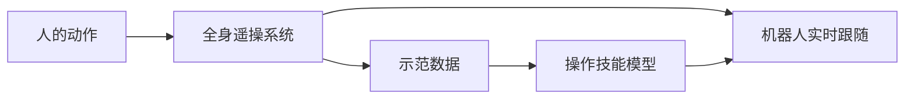

# 系统介绍

**全身遥操系统**让机器人在复杂场景下实时跟随人的全身动作。它有两个用途：**直接驱动**机器人完成作业，以及**采集示范数据**供后续训练。

<Stub>

- 补充系统的硬件组成与拓扑图
- 补充端到端时延的实测数据
- 说明支持的本体范围

</Stub>

## 两项核心能力

**全姿态动作跟踪** —— 全身多关节动态协调，动作姿态自适应跟踪。覆盖行走、小跑、快速横移，以及伸展、弯腰、下蹲等躯干与关节协同动作。

**免训练动作学习** —— 低时延遥操示范，无需额外训练即可实时复制动作。连太极这类复杂连续动作也能即时跟随。

## 两套方案

| 方案 | 设备 | 文档 |
| --- | --- | --- |
| PICO | PICO 头戴 + 手柄 + 足部绑带 | [PICO 遥操作](/docs/teleop/pico) |
| Xsens | Xsens 动捕服 + 上位机 | [Xsens 遥操作](/docs/teleop/xsens) |

两者共用同一套代码环境，先完成 [环境配置](/docs/teleop/setup) 再选一条走。

## 在工具链里的位置

遥操系统是 [整机数采训练](/docs/training/intro) 的数据入口——第一步「采集」就是通过全身遥操作录制任务示范数据。

也就是说，同一套遥操链路既能当「遥控器」直接用，也能当「录制设备」产出训练数据。

## 接下来

- 先搭环境 → [环境配置](/docs/teleop/setup)
- 用 PICO 遥操 → [PICO 遥操作](/docs/teleop/pico)
- 用 Xsens 遥操 → [Xsens 遥操作](/docs/teleop/xsens)
- 用它采数据 → [数据准备](/docs/training/data)
