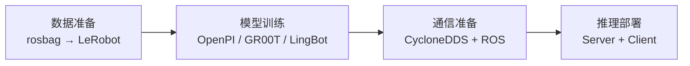

# 全身 VLA 概览

**Roban 全身 VLA** 覆盖从数据转换、模型训练，到基于 CycloneDDS 与 HEFT 的真机推理的完整流程。

:::note 上游文档
本模块内容与 [LeTools-Learning 文档](https://www.letools.lejurobot.com/docs.html#tutorials/roban_wholebody_vla.md) 同源，以那边为准。发现不一致时请以上游为准并回报。
:::

## 规格

| 项目 | 说明 |
| --- | --- |
| 状态 | **23 维**：左臂 4 + 左爪 1 + 右臂 4 + 右爪 1 + 左腿 6 + 右腿 6 + 腰 1 |
| 动作 | **32 维**：上述 23 维 + `root_xyz` 3 + `root_rot6d` 6 |
| 图像 | 仅头部相机 |
| 频率 | 训练与 HEFT 控制均为 **50 Hz** |
| 布局定义 | `kuavo_data/modality_templates/roban_wholebody_modality.json` |
| 支持模型 | OpenPI、Isaac GR00T N1.7、LingBot-VLA v2 |

维度顺序与 `kuavo_data/roban_data/config.py` 中的 `WHOLEBODY_STATE_NAMES` / `WHOLEBODY_ACTION_NAMES` 一致。

## 流程

| 步骤 | 做什么 | 文档 |
| --- | --- | --- |
| 数据准备 | rosbag 转 LeRobot v3 数据集 | [数据准备](/docs/training/data) |
| 模型训练 | 三个外置模型各自训练 | [模型训练](/docs/training/model-training) |
| 通信准备 | 控制器切换、CycloneDDS、有线与 ROS 通信 | [通信准备](/docs/training/communication) |
| 推理部署 | 启动推理 Server 与 Client | [推理部署](/docs/training/inference) |

## 前置条件

使用前请先装好 LeTools 主环境和对应的外置模型环境。

通用 Kuavo 双臂流程不在本模块范围内，本模块只覆盖 **Roban wholebody VLA 的差异**。

## 检查清单

上真机前逐条确认：

1. 数据集是 **23D state / 32D action**、只有头相机、**50 Hz**
2. 三个模型都**不要误用** Kuavo 双臂 adapter（`openpi` / `groot` / `lingbotvla2`）
3. OpenPI 的 `policy_config_name`、LingBot 的 `lingbotvla_cli.yaml` 与 `robot_norm_path` **必须来自同一次训练**
4. 边侧机可以 ping 通 `192.168.26.1` / `192.168.26.12`，ROS 能收到压缩图，`controller_switch_cli amp` 能发出切换
5. `cyclonedds_roban_edge.xml` 的网卡名和 `heft.switch_*` 路径已换成实际机器
