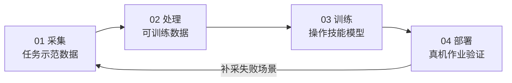

# 四步总览

每个操作技能都走同一条路：**采集 → 处理 → 训练 → 部署**。流程固定下来，结果才可复现、可比较、可交接。

<Stub>

- 每一步补上实际命令与产物路径
- 补充各步骤的典型耗时与资源占用
- 明确产物的命名与归档规范

</Stub>

## 流程

| 步骤 | 产物 | 做什么 |
| --- | --- | --- |
| [01 采集](/docs/training/collect) | 任务示范数据 | 全身遥操作，采集协同作业过程 |
| [02 处理](/docs/training/process) | 可训练数据 | 自动化清洗与标注，输出标准可训练数据 |
| [03 训练](/docs/training/train) | 操作技能模型 | 端到端模型训练，训练数据实时查看 |
| [04 部署](/docs/training/deploy) | 真机作业验证 | 全身操作模型，实现全自主作业 |

注意那条回边：真机上暴露的失败场景要回到采集补数据。**这条回边才是实际工作中花时间最多的地方。**

:::tip 效果不好先看数据
回到第 03 步调超参之前，先确认不是数据的问题——覆盖不足、标注错误、时间对齐偏差造成的失败，调多少次超参都救不回来。
:::

## 产物要求

一次完整的训练应当产出：

| 产物 | 说明 |
| --- | --- |
| 模型权重 | 可被部署环节加载 |
| 训练配置 | 完整的、可直接复现本次训练的配置 |
| 评测记录 | 验证结果与失败案例 |
| 数据集版本 | 本次训练用的数据集标识与版本 |

:::warning 四样缺一不可
少了任何一样，这次训练就是不可复现的。三个月后没人能说清楚那个权重是怎么来的。
:::

## 前置条件

- 遥操链路已搭好并标定 → [设备与标定](/docs/teleop/setup)
- 了解数据格式约定 → [数据格式](/docs/datasets/format)
- 也可以直接用现成数据起步 → [开源真机数据集](/docs/datasets/intro)
